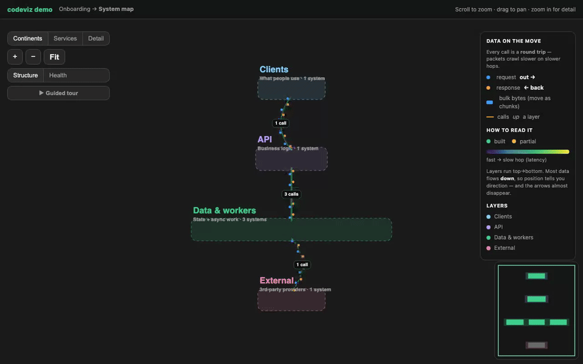
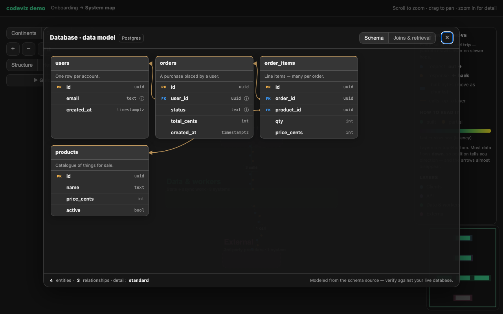
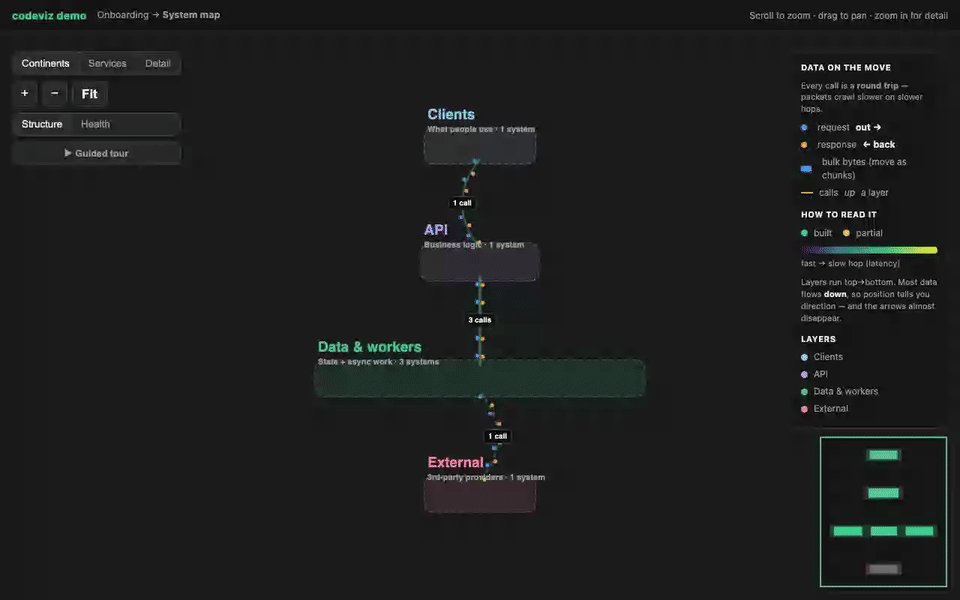

# codeviz

**Interactive system-design onboarding for any codebase** — a [Claude Code](https://docs.claude.com/en/docs/claude-code) plugin.

Point it at a repo and it generates linked, **interactive** HTML that gets a new engineer productive fast — a system you *explore*, not a static diagram. Self-contained: opens over `file://`, no server, no CDN.



## The system map

A zoomable **atlas** — every box a real system, every arrow a real call, in colour-coded layers. Scroll continents → services → detail, click a system to focus its neighbourhood, hover a connection to see what it carries. Try it: [`examples/demo/system-map.html`](examples/demo/system-map.html).

Its **guided tour** walks a real request hop by hop — and it's **diggable**, one dial, three depths:

- **Overview** — just the hop, what moves where
- **Walkthrough** — the request and why it works that way (the default)
- **Deep dive** — a from-scratch explanation, every term defined

Go past the recommended depth and it asks first: *"reference detail, not insight — dig in anyway?"*

## Data models you can read at a glance



Click any **datastore** → its full ER diagram, built from the **real** schema (SQL / migrations / ORM / NoSQL). Tables lay themselves out **by dependency** — roots left, junction tables right — with crow's-foot *many→one* cardinality and foreign keys drawn as connectors to the key they point at. **Hover a table to spotlight just its relationships;** junction and hub tables are auto-badged. A **Dig depth** dial controls detail: Entities → Keys → Columns → Everything.

Grounded only: it never invents tables, marks unbuilt ones `planned`, and badges the page *"modeled from the schema — verify against your live database."*

## Real health, not just illustrative



A **Structure ↔ Health** toggle. Scenarios are illustrative by default (badged *"modeled — not observed"*); `/codeviz-scenario` models a what-if up the call graph. For **real** status, `/codeviz-health` reads your local **Docker** and writes an **observed**, point-in-time snapshot you can toggle to — never fabricated.

## Select anything → explain it, on-device

Run `/codeviz-explain` to add an opt-in AI explainer to the generated pages. The reader downloads a small model into their browser once, then **highlights any text** for an explanation that streams in **right at the selection**.

- **On-device.** The model — **WebLLM · `Llama-3.2-3B-Instruct`** (~1.8 GB, WebGPU) — runs in the browser. The *only* network call is the one-time weight download (cached after); then the page works offline and **nothing the reader selects ever leaves their machine**.
- **Context-aware.** The layer walks the DOM and hands the model the structured context around the selection — a column's type, keys and parent table; the datastore; a tour step's hop — so it explains *that exact thing*, not the words in the abstract.
- **Inline, not a chatbot.** The answer appears in a tooltip at the selection. No side panel, no tab to switch to. Output is rendered as text (never HTML), and all UI is namespaced so it can't touch the page.
- **Requirements.** A WebGPU browser (Chrome/Edge). Works over `file://` in Chrome; otherwise serve the folder locally. Low-VRAM machines can swap to a 1B/1.5B model.

### Using the on-device explainer

**1. Generate a map first.** The explainer attaches to existing codeviz pages, so run `/codeviz` (or `/codeviz map`) before anything else.

**2. Inject the layer.** Run the skill on your output dir:

```
/codeviz-explain                                          # defaults to docs/onboarding
# or directly:
node skills/codeviz-explain/assets/inject-explain.js docs/onboarding
```

This inlines a small script + styles into `system-map.html`, `data-model.html`, and any other generated pages. It's **idempotent** — re-running it (e.g. after you regenerate a page) is safe.

**3. Open the page in a WebGPU browser.** Chrome or Edge (recent). Over `file://` it works in Chrome; if your browser blocks the model import from a `file://` page, serve the folder and open `http://localhost:8000`:

```
python3 -m http.server -d docs/onboarding 8000
```

**4. Enable the model (one time).** Click the **💡 Explain** pill (bottom-left) → **Enable**. The model (`Llama-3.2-3B-Instruct`, ~1.8 GB) downloads into the browser with a progress bar; the page stays usable. It's cached (IndexedDB), so the next visit loads from disk and the choice is remembered.

**5. Select any text.** Highlight a table, a column, a tour step — an explanation streams into a tooltip **at the selection**. Dismiss with Esc, a click away, or a new selection. The model runs entirely on your device; after the one-time download it works offline and nothing you select is sent anywhere.

**Swap the model (optional).** Edit the constants at the top of `skills/codeviz-explain/assets/explain.js`:

```js
var MODEL_ID    = 'Llama-3.2-3B-Instruct-q4f16_1-MLC';   // any WebLLM prebuilt
var MODEL_LABEL = 'Llama 3.2 3B';
var MODEL_SIZE  = '~1.8 GB';
```

| goal | `MODEL_ID` | size |
|---|---|---|
| lighter / faster, low-VRAM | `Llama-3.2-1B-Instruct-q4f16_1-MLC` | ~0.9 GB |
| lighter, strong | `Qwen2.5-1.5B-Instruct-q4f16_1-MLC` | ~1.0 GB |
| **default (balanced)** | `Llama-3.2-3B-Instruct-q4f16_1-MLC` | ~1.8 GB |
| higher quality | `Qwen2.5-3B-Instruct-q4f16_1-MLC` · `Phi-3.5-mini-instruct-q4f16_1-MLC` | ~2.0–2.2 GB |

After editing, re-inject (regenerate the base page first if needed). Full reference — architecture, the context-extraction internals, privacy, testing, and troubleshooting: [`skills/codeviz-explain/DOCS.md`](skills/codeviz-explain/DOCS.md).

## Install

```
/plugin marketplace add yeshdev1/codeviz
/plugin install codeviz
```

## Commands

`/codeviz` builds the docs; the rest extend or operate on a generated map. Costs are output tokens — order-of-magnitude, scaling with repo and schema size.

| command | what it does | avg tokens |
|---|---|---|
| **`/codeviz [scope] [path]`** | build the interactive map (+ opt-in data-model, API, themed pages). Bare = size-scan & pick; or one scope — `map` · `steps` · `schema` · `api` · `theme` · `full` | ~3k–200k |
| **`/codeviz-datamodel [overview\|standard\|full]`** | per-datastore ER diagram from the real schema, with the Dig-depth dial | ~6–12k · 12–25k · 25–50k+ /store |
| **`/codeviz-capture <scene>`** | record an MP4/GIF of a scene — `tour` · `digtour` · `er` · `digdata` · `health` · `zoom` · `focus` (local Playwright + ffmpeg) | ~1–3k |
| **`/codeviz-health`** | snapshot real Docker status (state, uptime, restarts) into the map | ~3–10k |
| **`/codeviz-scenario "<what-if>"`** | model a failure's blast radius as a switchable scenario | ~3–10k |
| **`/codeviz-explain`** | inject an opt-in **on-device** LLM — the reader selects any text for an inline explanation | ~0 (runs in the reader's browser) |
| **`/dig-codeviz <step>`** | one level of `file:line`-cited detail on a step; hard-stops at 5 digs | ~8–20k /dig |

## Run only what you need

`/codeviz` is **granular** — every output is opt-in, because a full run on a large repo can cost **150k+ tokens**. Run it with **no scope** and it **size-scans** the repo (services, routes, models, rough LOC), prints a **per-scope estimate**, and lets you pick what to generate — never a silent full run. Pass one scope to skip the dialog (anything after it is the target path); `full` runs them all.

| scope | builds | rough cost |
|---|---|---|
| `map` | the interactive diagram (`system-map.html` + hub) | ~30–70k |
| `steps` | request/response detail + jargon per tour step | ~8–20k |
| `schema` | the static data-model page (`schema.html`) | ~15–35k |
| `api` | the full API surface (`api.html`) | ~40–110k |
| `theme` | detect the repo palette and theme the pages | ~3–8k |
| `full` | all of the above | ~90–200k |

The estimate scales with the scan (≈ ×0.5 for a tiny service, ×2 for a large monorepo) and is shown before anything runs. **Start with `map` + `steps`** (~40–90k) — the diagram plus narrated request flows; add `theme` (~3–8k) for the repo's own colors.

## How it works

**Plan → Generate → Debug → Deliver.** "Debug" means *interpret* the code so the docs reflect real behaviour (grounded in `file:line`) — not a correctness audit; a real bug spotted while reading goes to a `⚠ Noticed while reading` list, not a fix. Output lands in `docs/onboarding/`.

Authoring reference for the diagram data, scenarios, use cases and edge cases: [`skills/codeviz/DATA-SPEC.md`](skills/codeviz/DATA-SPEC.md).

## License

MIT — see [LICENSE](LICENSE).
